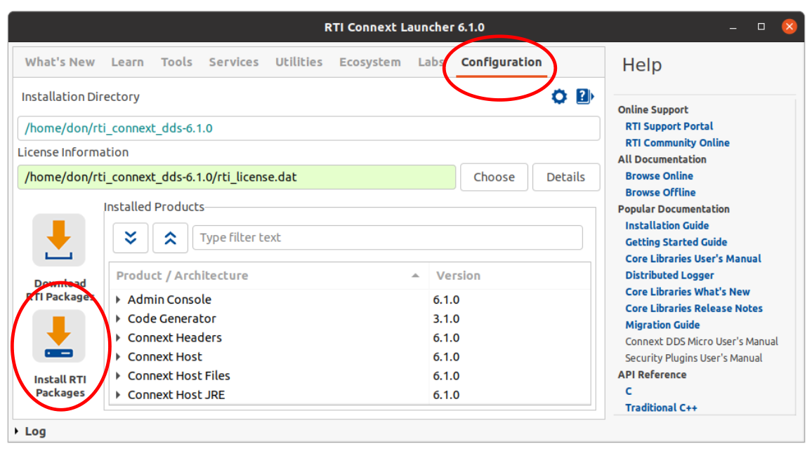
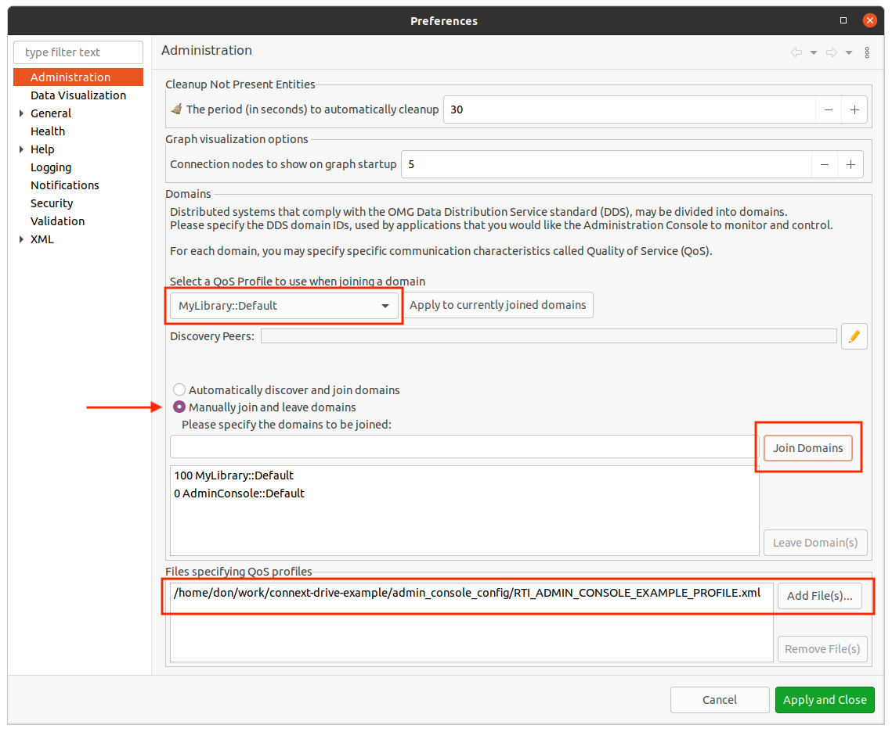

# Configuring Admin Console For Static Endpoint Discovery

## Overview

One of the core features of DDS is “discovery”-- the mechanism by which a DDS application can learn about other DDS applications and their endpoints. In the majority of DDS applications, the discovery process is fully dynamic, meaning that no a priori knowledge about remote applications is required by the local application.

In some DDS systems however, particularly those that require very high determinism such as safety critical applications, it is advantageous to use “static” endpoint discovery. In this static approach, each DDS application programmatically asserts which remote DomainParticipants it is expecting to discover at runtime, and what DataReaders and DataWriters (endpoints) those remote DomainParticipants contain. These assertions enforce what *can* be discovered, not necessarily what *will* be discovered; this is due to the fact that a DomainParticipant the local application is expecting may never actually be present in the system.

**RTI Connext DDS Micro** and **RTI Connext DDS Cert** include the Dynamic Participant Static Endpoint (DPSE) discovery plugin that can be used to achieve static discovery. This plugin is part of every Connext Drive, Connext Micro, and Connext Cert installation. **RTI Connext Professional** can support static discovery through the use of the optional Limited Bandwidth Endpoint Discovery (LBED) Plugins.

RTI’s **Admin Console** tool uses the RTI Connext Professional libraries and therefore must make use of the LBED plugins.

## Assumptions

For the purpose of this document, it is assumed that RTI Connext Professional 6.1.0 is installed on the development host and that the Admin Console version matches this installation.

Lastly, it is assumed that readers of this document are familiar with all aspects of configuring the environment and building applications for both Pro and Micro.

# Installing the LBED Plugins

## Download the Plugins

First, log into the customer support portal at https://support.rti.com then select the LBED version that is appropriate for your development host.

### 64-bit Linux hosts
https://support.rti.com/s/downloads?filename=rti_limited_bandwidth_endpoint_disc_host-6.1.0-x64Linux.rtipkg

## Install the Plugins
Open the RTI Launcher, and move to the Configuration tab. Click on the “Install RTI Packages” button, navigate to your downloaded file, and install.



# Start and Configure Admin Console

Now that the LBED plugins are installed, you must configure Admin Console to use them; this is done in the tool’s quality of service (QoS) settings. 

## Loading the QoS File 

The QoS file in this example-- `RTI_ADMIN_CONSOLE_EXAMPLE_PROFILE.xml`-- is essentially a clone of the default one used by Admin Console with the exceptions that it:

1. Renames the QoS library to MyLibrary
2. Adds a QoS profile named MyLibrary::MicroVisualization
2. Contains information about where Admin Console should find the LBED plugin, and where to find the static discovery information

**NOTE:** This QoS file tells the LBED plugin where the endpoint discovery configuration file can be found. In `RTI_ADMIN_CONSOLE_EXAMPLE_PROFILE.xml` you will see this in the following section. The path in the `<value></value>` tags should be modified to match your environment. 
```
    <element>
        <name>dds.discovery.endpoint.lbediscovery.config_file</name>
        <value>/home/don/work/connext-drive-example/admin_console_config/endpoint_discovery_info.xml</value>
    </element>
```  
After starting Admin Console, open the preferences dialog from "View-->Preferences" in the menu bar. Use the "Add Files" button near the bottom of the window to specify the `RTI_ADMIN_CONSOLE_EXAMPLE_PROFILE.xml` file. Then manually join Domain 100, selecting **MyLibrary::Default** from the drop-down list of QoS profiles.



At this point, Admin Console should visualize the `HelloWorld_publisher` and `HelloWorld_subscriber` applications when they are run.